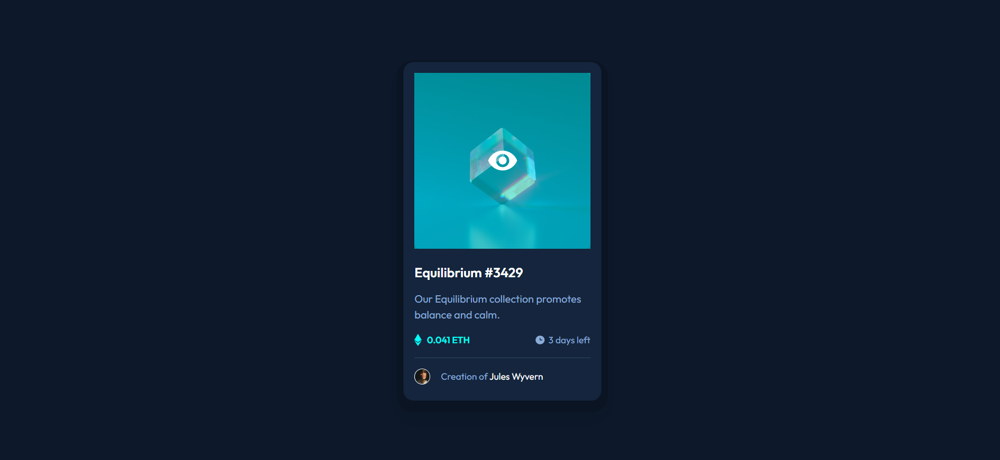
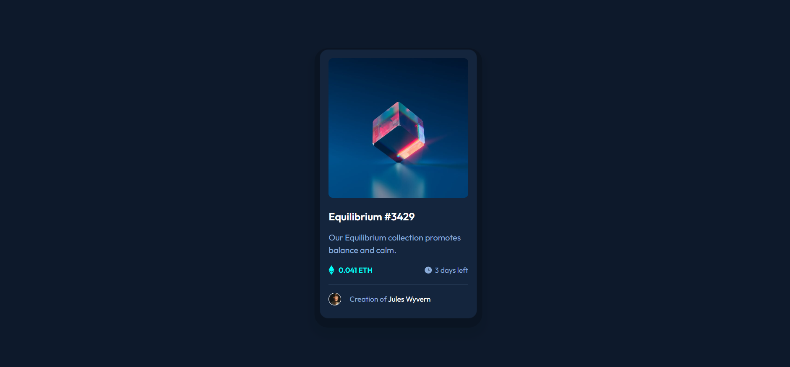
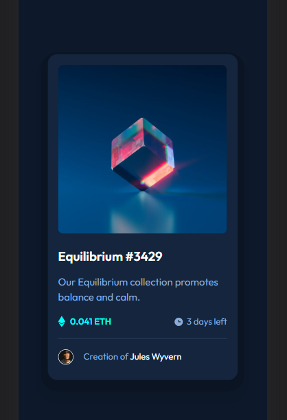

# Frontend Mentor - NFT preview card component solution

This is a solution to the [NFT preview card component challenge on Frontend Mentor](https://www.frontendmentor.io/challenges/nft-preview-card-component-SbdUL_w0U). Frontend Mentor challenges help you improve your coding skills by building realistic projects. 

## Table of contents

- [Overview](#overview)
  - [The challenge](#the-challenge)
  - [Screenshot](#screenshot)
  - [Links](#links)
- [My process](#my-process)
  - [Built with](#built-with)
  - [What I learned](#what-i-learned)
  - [Continued development](#continued-development)
  - [Useful resources](#useful-resources)
- [Author](#author)

**Note: Delete this note and update the table of contents based on what sections you keep.**

## Overview

### The challenge

Users should be able to:

- View the optimal layout depending on their device's screen size
- See hover states for interactive elements

### Screenshot

### Links

- Live Site URL: [here](https://fiqihalfito.github.io/NFT-preview-card-component/)

## My process

### Built with

- Semantic HTML5 markup
- CSS custom properties
- Flexbox
- Mobile-first workflow
- Bootstrap 5

### What I learned

I don't know how to hover an image. So I make hover element over the image. I don't know if it's the proper way. But you may give me some advise. Thank you.

### Continued development

I want to make this component using Next.Js 13

### Useful resources

- [Bootstrap](https://getbootstrap.com/) - to build grid layout fast.

## Author

- Github - [Fiqih Alfito](https://github.com/fiqihalfito)
- LinkedIn - [@fiqih-alfito](https://www.linkedin.com/fiqih-alfito/)
